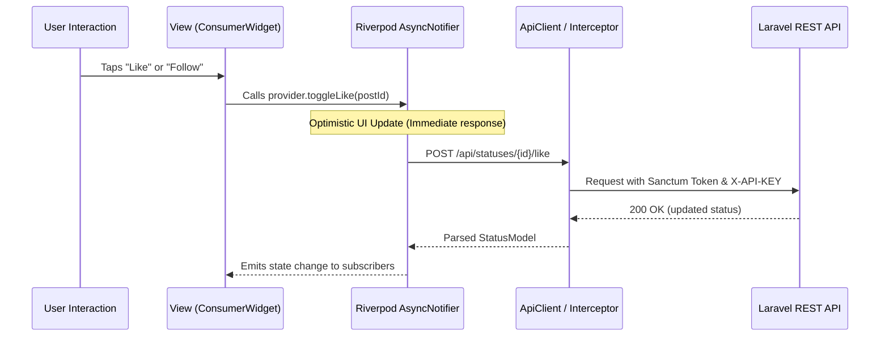

# Architecture & Design Patterns

The **MYADS Mobile Application** is engineered following modern Flutter best practices, emphasizing **Clean Architecture**, **Single Responsibility Principle (SRP)**, and **Unidirectional Data Flow**.

---

## 1. High-Level Architectural Layers

The codebase is partitioned into three distinct vertical layers:

```
┌─────────────────────────────────────────────────────────┐
│                   Presentation Layer                    │
│   (Screens, Widgets, ShellRoute, Material 3 Theme)      │
└────────────────────────────┬────────────────────────────┘
                             │ Watches / Dispatches
┌────────────────────────────▼────────────────────────────┐
│                    Application Layer                    │
│   (Riverpod Providers, AsyncNotifier, Controllers)      │
└────────────────────────────┬────────────────────────────┘
                             │ Calls
┌────────────────────────────▼────────────────────────────┐
│                  Data & Network Layer                   │
│   (Dio Client, ApiInterceptor, Models, SecureStorage)   │
└─────────────────────────────────────────────────────────┘
```

### 1.1 Presentation Layer
- Built with Flutter Material 3 widgets.
- Separated into **Screens** (top-level route targets) and reusable **Widgets** (dumb presentation components).
- Relies on GoRouter for declarative navigation.
- Consumes state via `ConsumerWidget` or `ConsumerStatefulWidget` without embedding raw business logic.

### 1.2 Application Layer (State Management)
- Powered exclusively by **Riverpod 3**.
- Uses `AsyncNotifierProvider` for state that involves asynchronous network operations (feed pagination, user profile fetching, video hub loading).
- State mutations trigger immutable updates (`state = AsyncValue.data(updatedState)`), guaranteeing zero UI race conditions.

### 1.3 Data & Network Layer
- **Dio Client:** Encapsulates network transport with timeout configurations.
- **Interceptors:** Automatically injects security headers (`X-API-KEY`, `Authorization: Bearer <token>`) and language headers (`Accept-Language`, `X-Locale`).
- **Data Models:** Immutable Dart classes featuring explicit `fromJson` and `toJson` serialization factories.
- **Hardware-Backed Storage:** Tokens are encrypted on-device via `flutter_secure_storage`.

---

## 2. Unidirectional Data Flow Pattern



---

## 3. Key Design Patterns Implemented

### 3.1 Singleton Pattern (`ApiClient`, `PushNotificationService`)
Critical services that manage persistent connection pools or external SDK instances are implemented as thread-safe singletons:
```dart
class ApiClient {
  static final Dio _dio = Dio(BaseOptions(
    baseUrl: dotenv.env['BASE_URL'] ?? 'http://localhost/myads/api',
    connectTimeout: const Duration(seconds: 30),
    receiveTimeout: const Duration(seconds: 30),
  ))..interceptors.add(ApiInterceptor());

  static Dio get instance => _dio;
}
```

### 3.2 Interceptor Pattern (`ApiInterceptor`)
All outgoing HTTP requests and incoming responses pass through `ApiInterceptor`, centralizing authentication, header injection, localization headers, and error logging in one place.

### 3.3 Shell Navigation Pattern (`ShellRoute`)
The main navigation shell (`MainShellScreen`) remains active while child screens (`HomeScreen`, `VideoHubScreen`, `ClipsScreen`, `ExploreScreen`, `ProfileScreen`) are swapped in the body, maintaining bottom bar state and scroll positions.

### 3.4 Defensive Data Model Pattern
To guard against deleted users or partially corrupted database records, models provide validation getters rather than raw property checks:
```dart
bool get isValid => id.isNotEmpty && id != '0' && username.isNotEmpty && username != 'unknown';
```

---

## 4. Architectural Best Practices

1. **Zero Raw HTTP in Widgets:** Screens must never call `Dio` directly. All network requests must flow through dedicated providers or services.
2. **Immutable State:** Avoid in-place mutations of lists or model instances. Always create new collections using `.map()`, `copyWith()`, or list spreads `[...items]`.
3. **Graceful Degradation:** When optional relations are missing (e.g. `repost_record`, `attachments`), models safely fallback to null or empty collections without throwing exceptions.
