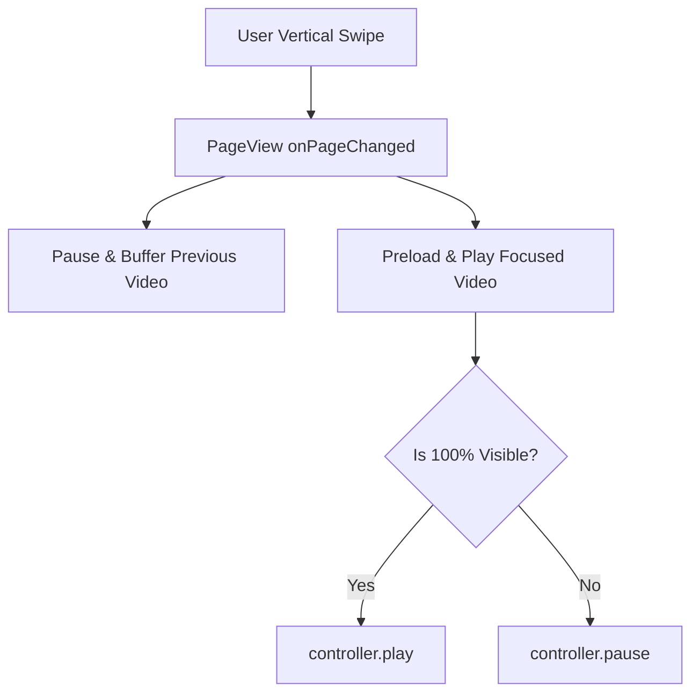

# Clips Short-Form Video System

The **Clips System (`/clips`)** delivers a native, vertical-swipe short-form video experience directly comparable to TikTok, YouTube Shorts, and Instagram Reels.

---

## 1. Technical Implementation

* **Playback Engine:** Native video decoding via `video_player`.
* **Gesture Controls:** Vertical `PageView.builder` with physics tuned for snappier page snaps.
* **Visibility Detection:** Utilizes `visibility_detector` to automatically pause videos when scrolled out of view and resume playback when focused.

---

## 2. Interaction Suite

Each clip features a vertical floating action bar on the right edge:
1. **Publisher Profile:** Circular avatar with a 1-tap Follow button.
2. **Like Button:** Animated heart with dynamic count updates.
3. **Comment Button:** Bottom sheet with threaded comment replies.
4. **Share Button:** Invokes native Android share sheet via `share_plus`.
5. **Save Button:** Bookmarks the clip to the user's private **Saved Clips** library.

---

## 3. Memory & Controller Management

To prevent memory leaks and out-of-memory crashes:
* No more than **3 video controllers** are kept in memory simultaneously (active video, previous video, next video).
* Controllers beyond this window are disposed immediately using `controller.dispose()`.
