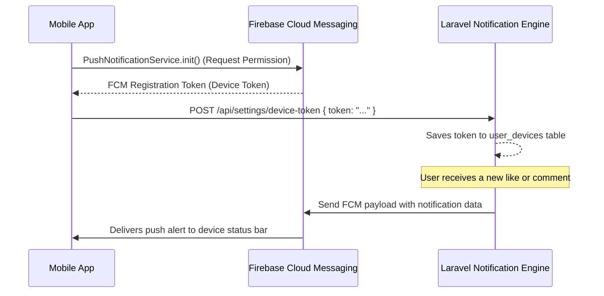

# Firebase Push Notifications (FCM)

Push notifications keep members engaged by delivering instant alerts for likes, comments, private messages, and administrative announcements.

---

## 1. Firebase Integration Architecture



---

## 2. Service Implementation (`PushNotificationService`)

Encapsulated inside `lib/core/services/push_notification_service.dart`:

```dart
class PushNotificationService {
  final FirebaseMessaging _fcm = FirebaseMessaging.instance;

  Future<void> init() async {
    // 1. Request notification permissions
    NotificationSettings settings = await _fcm.requestPermission(
      alert: true,
      badge: true,
      sound: true,
    );

    if (settings.authorizationStatus == AuthorizationStatus.authorized) {
      // 2. Retrieve device token
      String? token = await _fcm.getToken();
      if (token != null) {
        await _registerTokenWithServer(token);
      }

      // 3. Listen for token refresh events
      _fcm.onTokenRefresh.listen((newToken) {
        _registerTokenWithServer(newToken);
      });

      // 4. Handle foreground notifications
      FirebaseMessaging.onMessage.listen((RemoteMessage message) {
        // Show in-app notification banner or update badge count
      });
    }
  }

  Future<void> _registerTokenWithServer(String token) async {
    await ApiClient.instance.post('/settings/device-token', data: {'token': token});
  }
}
```

---

## 3. Background & Terminated Notification Handling

In `main.dart`, top-level background handlers process incoming pushes even when the application is closed:

```dart
@pragma('vm:entry-point')
Future<void> _firebaseMessagingBackgroundHandler(RemoteMessage message) async {
  await Firebase.initializeApp();
  debugPrint('Handled background message: ${message.messageId}');
}
```

Tapping a notification automatically routes the user to the relevant screen (`/post/:id` or `/messages/chat/:routeKey`) based on the `click_action` payload.
