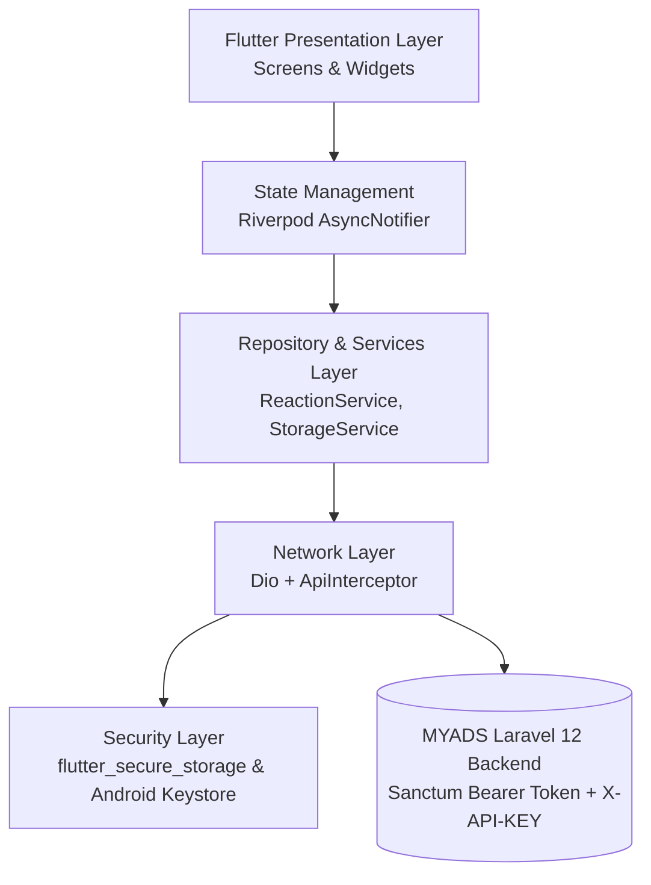

# MYADS Mobile App — Official Documentation & Wiki

Welcome to the comprehensive technical documentation and knowledge base for the **MYADS Flutter Mobile Client** (`myads_app`)!

> **Version:** 1.7.8+20 | **Target Platform:** Android (API 23+) & iOS | **Framework:** Flutter 3.27+ (Dart) | **Backend:** Laravel 12 REST API (Sanctum)

The MYADS Mobile App is an enterprise-grade mobile client built with Flutter. It connects seamlessly to the MYADS social networking and advertising exchange ecosystem, offering native performance, hardware-accelerated security, short-form video clips, a dedicated video hub, real-time private messaging, and full multilingual localization.

---

## 🧭 Documentation Directory

Explore the 8 core documentation categories below:

### 🚀 1. Overview & Architecture

| Guide | Page Link | Description |
| :--- | :--- | :--- |
| Documentation Portal Home | [Home](Home) | Main documentation portal and system overview. |
| Architecture & Design Patterns | [Architecture-and-Design-Patterns](Architecture-and-Design-Patterns) | Clean Architecture, Riverpod state management, and GoRouter patterns. |
| Project Structure & Directories | [Project-Structure-and-Directory-Guide](Project-Structure-and-Directory-Guide) | Detailed walk-through of lib/ directories, models, and features. |

### ⚙️ 2. Getting Started & Setup

| Guide | Page Link | Description |
| :--- | :--- | :--- |
| Prerequisites & Environment Setup | [Prerequisites-and-Environment-Setup](Prerequisites-and-Environment-Setup) | Flutter SDK, Android SDK, JDK 17, and emulator setup instructions. |
| Configuration & Environment Variables | [Configuration-and-Environment-Variables](Configuration-and-Environment-Variables) | Environment variables (.env), BASE_URL, and API keys. |
| Development Workflow & CLI Commands | [Development-Workflow-and-CLI-Commands](Development-Workflow-and-CLI-Commands) | Essential CLI commands: pub get, gen-l10n, analyze, and run. |

### 🛡️ 3. Network, API & Security

| Guide | Page Link | Description |
| :--- | :--- | :--- |
| API Client & Dio Networking | [API-Client-and-Dio-Networking](API-Client-and-Dio-Networking) | Dio HTTP client, interceptors, and error handling. |
| Two-Layer Authentication & Sanctum | [Two-Layer-Authentication-and-Sanctum](Two-Layer-Authentication-and-Sanctum) | Two-layer auth: X-API-KEY and Laravel Sanctum Bearer tokens. |
| Hardware-Encrypted Token Storage | [Hardware-Encrypted-Token-Storage](Hardware-Encrypted-Token-Storage) | Hardware-backed Android Keystore token storage via flutter_secure_storage. |
| Mobile Security & Hardening | [Mobile-Security-and-Hardening](Mobile-Security-and-Hardening) | HTTPS enforcement, HTML tag blocklist, and SafeUrlLauncher. |

### 🎬 4. Media, Video Hub & Clips

| Guide | Page Link | Description |
| :--- | :--- | :--- |
| Video Hub & Mobile Video Parity | [Video-Hub-and-Video-Parity](Video-Hub-and-Video-Parity) | Mobile video hub, 16:9 spotlight, category filter pills, and clips shelf. |
| Clips Short-Form Video System | [Clips-Short-Form-Video-System](Clips-Short-Form-Video-System) | Vertical short-form video feed with swipe gesture controls. |
| Rich Multimedia Layouts & Audio | [Rich-Multimedia-Layouts-and-Audio](Rich-Multimedia-Layouts-and-Audio) | Adaptive photo grids, waveform audio player cards, and downloads. |

### 💬 5. Social Features & Messaging

| Guide | Page Link | Description |
| :--- | :--- | :--- |
| Community Feed & Expandable Posts | [Community-Feed-and-Expandable-Posts](Community-Feed-and-Expandable-Posts) | PostCard composition, smooth expandable posts, and quote reposts. |
| Member Profiles & Subscriber Tiers | [Member-Profiles-and-Subscriber-Tiers](Member-Profiles-and-Subscriber-Tiers) | Hexagonal avatars, subscriber tier borders, and verified badges. |
| Member ID Privacy & Anti-Enumeration | [Member-ID-Privacy-and-Anti-Enumeration](Member-ID-Privacy-and-Anti-Enumeration) | Anti-enumeration, public_uid support, and user validity guards. |
| Private Messaging & Real-Time Chat | [Private-Messaging-and-Real-Time-Chat](Private-Messaging-and-Real-Time-Chat) | 1-on-1 private messaging, chat bubbles, and real-time polling. |

### 🔔 6. Notifications & Background Services

| Guide | Page Link | Description |
| :--- | :--- | :--- |
| Firebase Push Notifications (FCM) | [Firebase-Push-Notifications-Guide](Firebase-Push-Notifications-Guide) | FCM push notifications, device token registration, and background handlers. |
| In-App Notifications & Badge Counters | [In-App-Notifications-and-Badge-Counters](In-App-Notifications-and-Badge-Counters) | Notifications center, unread counters, and shell app bar indicators. |

### 🎨 7. Design System, Theming & i18n

| Guide | Page Link | Description |
| :--- | :--- | :--- |
| Design System & Material 3 Theming | [Design-System-and-Theming-Guide](Design-System-and-Theming-Guide) | Material 3 theming, dark/light modes, and Google Fonts Outfit. |
| Localization & RTL Layouts | [Localization-and-RTL-Layouts](Localization-and-RTL-Layouts) | Native Arabic/English support, automated RTL mirroring, and .arb dictionaries. |

### 📦 8. Store, Billing, Release & FAQ

| Guide | Page Link | Description |
| :--- | :--- | :--- |
| Digital Store, Orders & Billing | [Digital-Store-Orders-and-Billing](Digital-Store-Orders-and-Billing) | Digital products catalog, order history, and browser billing redirection. |
| Building, Signing & Release Guide | [Building-Signing-and-Release-Guide](Building-Signing-and-Release-Guide) | Android keystore, Gradle build scripts, and production release APK/AAB. |
| Troubleshooting, FAQ & Testing | [Troubleshooting-FAQ-and-Testing](Troubleshooting-FAQ-and-Testing) | Common errors, testing suites, and performance profiling. |

---

## 🏗️ System Architecture & Data Flow

---

## 🛠️ Technology Stack Summary

| Layer | Technologies & Dependencies | Purpose |
| :--- | :--- | :--- |
| **Framework** | Flutter 3.27+ / Dart 3.10+ | Cross-platform native mobile engine |
| **State Management** | `flutter_riverpod: ^3.3.1` | Reactive, compile-safe dependency injection & state |
| **Networking** | `dio: ^5.9.2` | HTTP client with request/response interceptors |
| **Routing** | `go_router: ^17.2.3` | Declarative nested shell routing & guards |
| **Local Storage** | `flutter_secure_storage: ^9.2.4`, `shared_preferences: ^2.5.5` | Encrypted token storage & user preferences |
| **Media Playback** | `video_player: ^2.9.6`, `chewie: ^1.10.0`, `just_audio: ^0.9.46` | Video hub, short clips & audio playback |
| **Push Notifications** | `firebase_core: ^4.12.1`, `firebase_messaging: ^16.4.3` | Background & foreground push messaging |
| **UI & Styling** | Material 3, `google_fonts: ^8.1.0` (Outfit) | Modern dark/light glassmorphic interface |
| **Localization** | `flutter_localizations`, `intl` | Dynamic English/Arabic i18n with full RTL |

---

*Part of the official [MYADS Ecosystem](https://github.com/mrghozzi/myads).*
