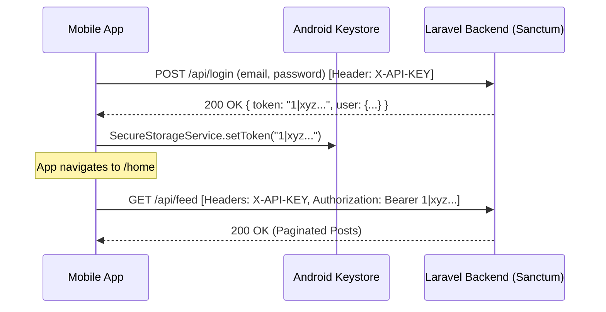

# Two-Layer Authentication & Laravel Sanctum

Security in the MYADS mobile ecosystem is designed with a defense-in-depth model utilizing **Two-Layer Authentication**:
1. **Client-Level Key (`MOBILE_API_KEY`)**: Validates that the request originates from an authorized first-party mobile client.
2. **User-Level Token (Laravel Sanctum)**: Validates the identity, permissions, and active session of the logged-in member.

---

## 1. Authentication Flow Diagram



---

## 2. Login & Registration Endpoints

### 2.1 Member Login (`POST /api/login`)
* **Headers Required:** `X-API-KEY: <key>`, `Accept: application/json`
* **Body:**
  ```json
  {
    "username_or_email": "member@example.com",
    "password": "SecretPassword123!"
  }
  ```
* **Success Response (200 OK):**
  ```json
  {
    "status": "success",
    "token": "4|aB9cDeFgHiJkLmNoPqRsTuVwXyZ1234567890",
    "user": {
      "id": "usr_9f8e7d",
      "username": "alex",
      "name": "Alex Mercer",
      "avatar_url": "https://adstn.ovh/uploads/avatars/alex.jpg",
      "is_verified": true,
      "subscription_tier": "Gold"
    }
  }
  ```

### 2.2 Rate Limiting Protection
To prevent brute-force attacks, the backend enforces rate limits:
* `/api/login`: **5 attempts per minute per IP**.
* `/api/register`: **3 attempts per minute per IP**.

---

## 3. Session Validation on Startup (`SplashScreen`)

When the user launches the app, `SplashScreen` inspects `SecureStorageService`:
1. Reads the cached token from Android Keystore.
2. If token exists, calls `GET /api/user/me` with the token.
3. If response is **200 OK**, populates `authProvider` and navigates to `/home`.
4. If response is **401/403** (revoked, expired, or deleted account), clears the token and redirects to `/login`.

```dart
Future<void> checkAuthentication(WidgetRef ref, BuildContext context) async {
  final token = await SecureStorageService.getToken();
  if (token != null && token.isNotEmpty) {
    try {
      final res = await ApiClient.instance.get('/user/me');
      ref.read(authProvider.notifier).setUser(UserModel.fromJson(res.data['user']));
      context.go('/home');
      return;
    } catch (_) {
      await SecureStorageService.clearToken();
    }
  }
  context.go('/login');
}
```

---

## 4. User Logout (`POST /api/logout`)

Logging out deletes both the local hardware-stored token and revokes the personal access token in the Laravel `personal_access_tokens` database table:
```dart
Future<void> logout() async {
  try {
    await ApiClient.instance.post('/logout');
  } catch (_) {}
  await SecureStorageService.clearToken();
  ref.read(authProvider.notifier).clearUser();
  router.go('/login');
}
```
